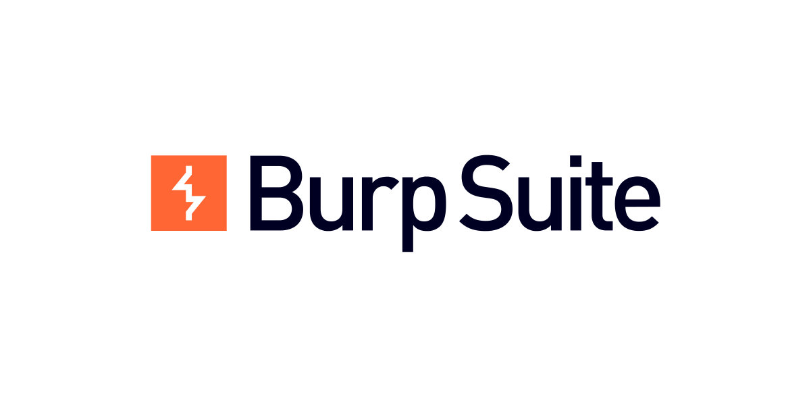

---
image: tryhackme_vulnversity.png
title: "TL;DR CTF Writeups: Vulnversity(TryHackMe)"
description: "CTF Writeup you should read BEFORE start the room"
slug: tldf_ctf_writeups_tryhackme_vulnversity
date: 2021-05-14T20:56:10.704Z
categories: Cybersecurity
tags: 
- "Cybersecurity"
- "CTF"
- "TryHackMe"
- "Pentesting"
- "GoBuster"
- "BurpSuite"
- "nmap"
- "Privilege Escalation"


---

## Series Brief

Cybersecurity has always been something I want to get into or at least apply my data science skills to. Not because of the 'Mr. Robot' style hollywood hacking scicne though, not that. Rather, I was drawn into it because it embodied curisity, hunger for knowledge, problem solving, and the mentality of always be tinkering things. 

Enter [TryHackMe](https://tryhackme.com/), the popular online platform that lets you learn cybersecurity through many short, gamified labs(VMs spun up with certain purpose and configuration). It is quite beginner friendly too. You don't have to build your own home lab and deal with those virtual machine configurations. They are already ready-made and ready to be exploited. It gives you access to other people's wisdom (CTF rooms developed by other experts or peers) where you can't have if you building your own home lab. This series is writeups that will record what I felt about the challenges and things I learned from them with a TLDR-kinda style.

---

## What to Expect for TLDR CTF Writeups
### Might Be Helpful if You:

- ✔️ Want a 20,000 ft view of what this room is about
- ✔️ Want all the leads to help you through the journey but still want to tackle it on your own
- ✔️ Finished the room but still want to see what is some good takeaways

### Might Want to Check Other Writeups if you:

- 🔶 Want a detailed step-to-step writeup to guide you through the challenge

For this purpose, I recommend this [writeup](https://0xa94.medium.com/tryhackme-vulnversity-ca0bdcc73386)

---

## Overall Feelings
Onto the room we'll be discussing today: TryHackMe: Vulnversity. It is the first real room if you choose the [Offensive Pentesting](https://tryhackme.com/paths) path (The first `Getting Started` and `Tutorial` are too easy to count).  Overall, I felt this room is quite well designed. It require some Linux command-line knowledge but nothing too fancy. It breaks the whole tasks into bite-size pieces so no single sub-task is too daunting to tackle. It condensed the typical hacking process of recon, exploit, post-exploit into these simple tasks, introduced you to tools and guide you through the thought process. Note that you still need to do some research on your own. The room won't spoon feeding you everything. But that's exactl where the fun is, right?

---

## Reasons to Try This Room
1. Learn basic hacking process (Recon -> Exploit  -> Post-Exploit)
2. Get familiar with some very essential hacking tools (`nmap`, `GoBuster`, `BurpSuite`, `systemctl`, etc.)
3. Get a taste of privilege escalation and reverse shell.

---

## Strategy/Tactics Used

- ➡️ Use `nmap` to gain knowledge of open port and services -> Find 80 port open, website on
- ➡️ Use `GoBuster` to search for folders on web-server -> Find an upload form on `internal` folder
- ➡️ Use `BurpSuite` to intercept the request and find out what upload format is supported -> `php` : No, `phtml`: YES!
- ➡️ Upload reverse-shell payload with `.phtml` extension to bypass filtering: -> Gain a reverse shell
- ➡️ Within the reverse shell, use `find` to search for SUID files that can be used for previlige escalation -> Find `/bin/systemctl`
- ➡️ Create a `SystemD` service file and use `/bin/systemctl` to enable and run it,. -> Gain root access! WIN!

---

## Tools/Command Used
### nmap

`nmap` is so essential in the recon process, this task is just scratching the surface. Some options used:
**-sV**: Attempts to determine the version of the services running
**-p xxx or -p-**: Port scan for port xxx or scan all ports
**-A**: Enables OS and version detection, executes in-build scripts for further enumeration

### GoBuster

[GoBuster](https://github.com/OJ/gobuster) is a URIs/DNS subdomain brute-force tool. It's developed in Go and will enumerate through the host name you give it and spit out directory and folders. It will work better with pre-built word list. The command used in the lab is:
```
	**gobuster dir -u http://<ip>:3333 -w <word list location>**
```

The work list can easily be under `**/usr/share/wordlists**` if you use Kali Linux.Some mentioned that [dirsearch](https://github.com/maurosoria/dirsearch) is a viable alternative here.
Using the tool, you can find an `upload` folder that you can upload file onto the web server.

### BurpSuite

Trying to upload some files and you'll find that most extensions are blocked. How to proceed? Enter [BurpSuite](https://portswigger.net/burp), according to [Arch Wiki](https://wiki.archlinux.org/title/Burp_suite), it is an *'integrated platform for performing security testing of web applications.'* Well, we'll just use it to intercept some web request and try different file extensions and see which one actually is not blocked. 
The gist of it is to try upload someting, intercept it using `BurpSuite`, then change the file extension part with a pre-loaded wordlist of all kinds of file extensions(e.g. `php`, `php5`, `phtml`, etc.) to test which one actully can bypass the web-server filter. 
Once found (`phtml`), just upload a `PHP`script of a reverse shell and upload to the web server, load it on the browser, then your listeing `nc -lvnp 1234` session will get the reverse shell.

### systemctl

Once we have the reverse shell, the last thing will be to previlige escalation.  One way of doing this is to search for executables with SUID permission. We do that with `find`:
```bash
find / -user root -perm -4000 -exec ls -ldb {} \\;
```
Out of the results returned, `/bin/systemctl` stands out. We can create some service 	file (e.g. `root.service`) and let `systemctl` start to get the previlege:
```bash
TF="root.service"
echo '[Service]
Type=oneshot
ExecStart=/bin/sh -c "cat /root/root.txt > /tmp/flag.txt"
[Install]
WantedBy=multi-user.target' > $TF
```
Note here you can't use text editor like `vim` or `nano` in a remote shell, just echo into the file. Not optimum, but get the job done. Once you have the `root.service` file, run `systemctl` to enable/start it:
```bash
/bin/systemctl enable /tmp/output/root.service
/bin/systemctl start /tmp/output/root.service

```
After the service is properly started, a simple `cat /temp/flag.txt` will give us the flag we want to pass the room.

## References
- [TryHackMe](https://tryhackme.com/)
- [TryHackMe: Vulnversity](https://tryhackme.com/room/vulnversity)
- [nmap](https://nmap.org/)
- [GoBuster](https://github.com/OJ/gobuster)
- [dirsearch](https://github.com/maurosoria/dirsearch)
- [BurpSuite](https://portswigger.net/burp)
- [php reverse shell](https://github.com/pentestmonkey/php-reverse-shell/blob/master/php-reverse-shell.php)
- [SUID escalation](https://gtfobins.github.io/gtfobins/systemctl/#suid)


