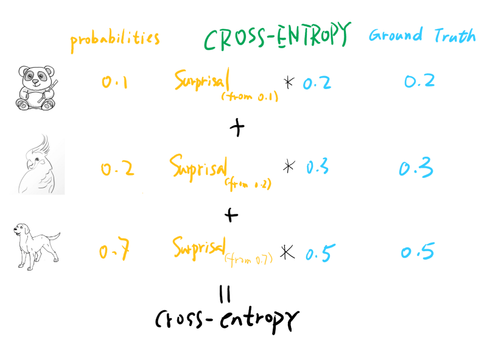
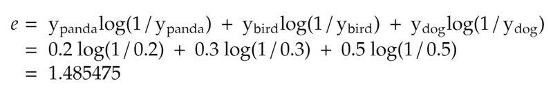

There is much to learn and grasp to ace that important Data Science/Machine Learning interview. This article is part of a series of articles that try to make the preparation process easier and less daunting by introducing structure, use visual explanations, and keeping things relevant.

### Motivation

The proper choice of loss functions is essential to train your machine learning models successfully. Thus questions about them are often brought up by the recruiters during the interview process. Questions may come from multiple fronts and angles, yet as long as you grasp the core concept, you will find that they won’t be much of a challenge. The **cross-entropy loss** is one of the most essential and widely used loss functions for multi-category classification problems. Why is it so popular? What are the core benefits? How to apply them properly?

Let’s dive in.

### Explain it in One Minute

In interviews, you will often be asked to explain a concept in one minute. This is to test your ability to articulate complicated concepts concisely. After all, only when you fully grasped it can you explain it succinctly, right? So we’ll start with the **TR; DR:**

> Cross-entropy loss is a loss function widely used for multi-class classification problems. It’s built on the concept of cross-entropy, which is a measurement of two probability vectors (often with one of them being one-hot encoded labels in datasets). It penalizes the error of the prediction when it’s too much ‘**away**’ from the target with the log curve (loss increase dramatically when the distance becomes bigger similar to square error). Cross-entropy loss is usually used with a soft-max activation function.

We will expand each of the four sentences into its separate section for the deep dive. Then we can look at it one more time to see whether our understanding has improved.

### Where is it used?

The cross-entropy loss function is mostly considered the de-facto loss function for **multi-category classification,** where the model has to predict one class out of many. For example, most image recognition models use soft-max activation function along with cross-entropy loss function to predict which category the image belongs to. One subset of the multi-class classifications worth mentioning here is the **Binary Classification** problem, which also uses the cross-entropy loss function. The binary classification model needs to predict whether a target is **0** or **1** and is actually the base for **multi-label** classification problems, for which we calculate the loss by adding the binary cross-entropy losses for each category together.

So, in short, the cross-entropy loss is used in:

> Multi-category classification

> Binary classification

> Multi-labels classification

### Cross-Entropy, Intuition with a step-by-step Explanation

To have an easy to digest intuition of cross-entropy, the best way is to follow this logic line:

> **Surprisal** ➡️ **Entropy** ️ ➡️ ️**Cross-entropy** ➡️ **Cross-Entropy Loss Function**

#### **Surprisal**

Simply put, surprisal is how surprised you are to see the outcome. If we go into a forest trying to find out the first animal we encounter, a panda 🐼 would have a very high surprisal value since we are not very likely to see one, while a bird 🐦 might be very low on surprisal. See below:

#### **Entropy**

Surprisal is good to measure how a single outcome will surprise us. If we have a random event that has multiple possible outcomes, then we can easily calculate how surprised we’ll get for this random event by multiply the surprisal and the probability of each outcome and add them together. The result and you guessed it, is **entropy**. See below:

For a deeper explanation of the Information Entropy concept, look at this video:

#### Cross-Entropy

Now entropy can be easily calculated given that we DO know the probabilities for each outcome. What if we don’t know exactly, but kind of guessed (or predicted the probabilities) it? The way to measure how surprised we are is to calculate the **cross-entropy**value, which multiplies the real probability of an outcome with our prediction or guess's surprisal value. Taking an extreme example, we have a loaded coin that will 99% turn-out **head**, but we thought it is a loaded coin that will have a 99% chance turn out **tail**. The cross-entropy will be quite big, as we’ll be very ‘surprised’ most of the time (we thought it would always give us tails but always give us heads instead). One thing to note here is, even if our probability prediction is not that far off, the cross-entropy is still always bigger than the entropy (only equal when you predict perfectly).

Note that the surprisal calculated for each label is based on the probability of the **predicted** value, not the ground truth. After all, how surprised you are is determined by how YOU perceive the outcome should be. [This answer](https://www.quora.com/Whats-an-intuitive-way-to-think-of-cross-entropy) in Quora gives a more detailed introduction to cross-entropy.

#### Cross-Entropy Loss

Once we understand what cross-entropy is, it’s easy to wrap our brain around the cross-entropy loss. The loss function calculates the cross-entropy value between the probability vector our model predicted and the ground truth (target variable, usually in the form of a one-hot encoded vector).

Here the predicted probability vector usually comes out of a softmax activation function, and the target (ground truth) vector is a one-hot encoded vector. See the below figure:

The only difference compared to normal cross-entropy is that usually, for a multi-label classification dataset, the target is one-hot encoded, which means only one label is true. So the cross-entropy loss only cares about the surprisal of this particular label. This is not always the case, though. Recent techniques like [Mixup ](https://arxiv.org/abs/1710.09412)and [Label Smoothing](https://towardsdatascience.com/label-smoothing-making-model-robust-to-incorrect-labels-2fae037ffbd0) already generate target probability vectors that are not one-hot encoded, yet cross-entropy still works perfectly in this case!

### Math time, Let’s calculate them all!

With the intuition out of the way, we can dive deeper into the math and calculate them all. We’ll try to use some examples to guide us through the calculation process.

#### **Surprisal:**

Say the chance that we encounter a panda 🐼 in the forest is **0.001**, then the surprisal is:

#### Entropy

Now, if we could actually run into three kinds of animals, **[ panda, bird, dog ]** with probabilities of **[ 0.2, 0.3, 0.5 ]**, the entropy of this event is:

#### Cross-Entropy (Loss)

Cross-Entropy compares the predicted probabilities with the ground truth, so suppose we have a prediction vector coming out of a SOFTMAX activation function for an image: **[ panda, bird, dog ] -> [ 0.1, 0.2, 0.7 ]**. This means the model is quite confident (70%) that this is a dog, and it is labeled as a dog too, which means the ground truth vector is: **[ 0, 0, 1 ]**.

From the above calculation, we can see that what really matters is the correct class, whether we have a high probability prediction or not.

#### Binary Cross-Entropy

One Special case for cross-entropy loss is **Binary Cross-Entropy Loss**, where only two classes are present. It can be calculated as the below formula shows:

Whereas ‘**p0**’ is 1 if the image is a cat and 0 if not, and ‘**q0**’ is the predicted probability of whether the image is a cat or not.

### Why Cross-Entropy

Now we have a pretty good understanding of what cross-entropy is and how to calculate it. Here comes the million-dollar question:

**Why is cross-entropy chosen as the cost function for multi-class classification?**

To answer this question, we can look at the case if we don’t use cross-entropy loss while we subtract between the target label and our predicted probability of that label. Since our prediction out of softmax activation function is between 0 and 1, the loss will thus be also between 0 and 1. This is very limiting. We want to punish the model when the prediction is off, so it’s better to have a bigger range, e.g., a logarithmic function. Let’s look at the log loss figure when true label = 1.

When the model predicts correctly, approaching 1, the loss is quite small, approaching 0. But the more away from 1 the predicted probability gets, the bigger the loss, approaching positive infinity. This obviously works better.

Another thing to note is the gradient of `cross-entropy(a,b)` is actually `softmax(a)-b` , means the gradient is linear to the activation output, which will make the training smooth. You can find out the gradient calculation in this nice [article](https://sefiks.com/2017/12/17/a-gentle-introduction-to-cross-entropy-loss-function/).

### **TL;DR, One More Time**

For a reminder, I put the ‘One Minute Pitch’ below to refresh your memory. Hopefully, now equipped with a deeper understanding of what they mean, it will make more sense to you.

> Cross-entropy loss is a loss function widely used for multi-class classification problems. It’s built on the concept of cross-entropy, which is a measurement of two probability vectors (often with one of them being one-hot encoded labels in training). It penalizes the error of the prediction when it’s too much ‘**away**’ from the target with the log curve (loss increase dramatically when the distance becomes bigger similar to square error). Cross-entropy loss is usually used with a soft-max activation function.

### Tests Your Knowledge!

Before you leave, please allow me to entertain you with some mock questions. It will hopefully test whether you’ve grasped everything in this article. And even if you do, it can serve as a memory refresher:

1. What is entropy? What is cross-entropy? What is the relationship between them?
2. Which area/models in Machine Learning/Deep Learning is cross-entropy loss function widely used? Why?
3. What is the mathematical character of the cross-entropy loss function? What advantage does it offer for the model training?
4. For a probability prediction vector is [0.7, 0.2, 0.1] on a target vector of [1, 0, 0], calculate the cross-entropy loss.
5. How to do multi-label cross-entropy calculation? How is it different from a multi-class single-label classification problem?

* * *
Written on January 17, 2021 by Michael Li.

Originally published on [Medium](https://medium.com/@lymenlee/data-science-interview-deep-dive-cross-entropy-loss-b10355eb4ace)
