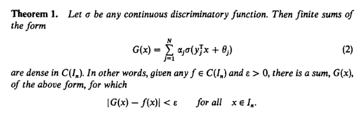
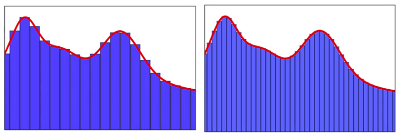
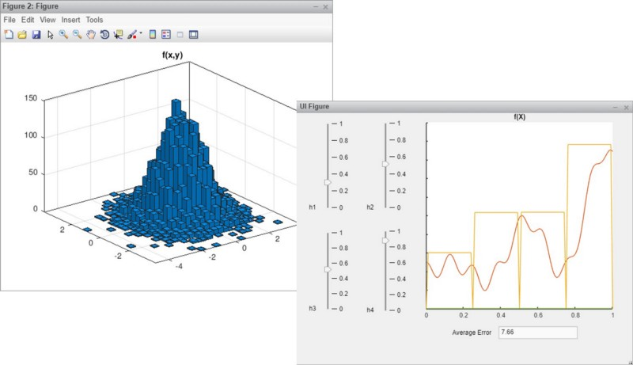
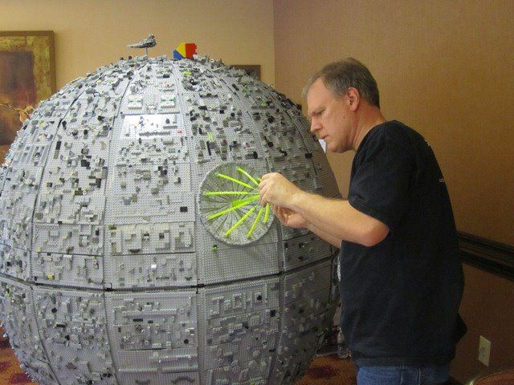
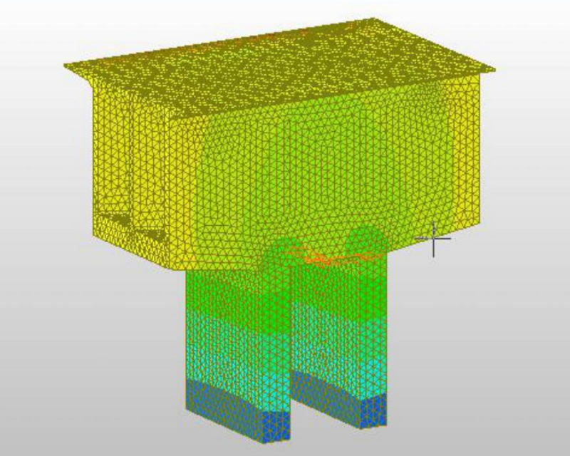
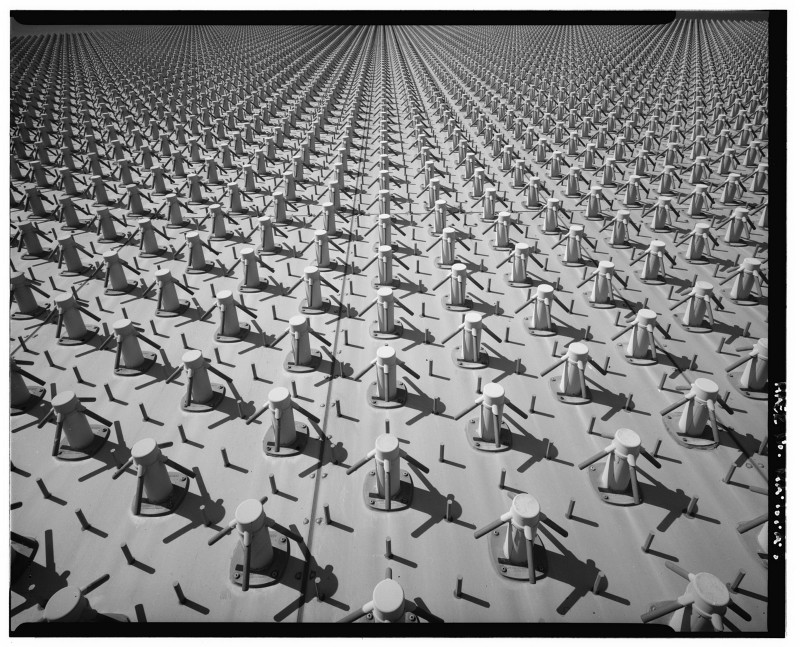
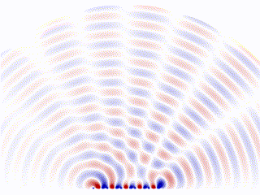

#### Why Deep Learning is so powerful yet so simple in its core

So you’ve heard about AI, heard about the amazing things a well-trained Machine Learning model, especially Deep Learning model can do. In some tasks, it even surpasses human performance. For example, a computer can now recognize different kinds of objects like cats, dogs, cars better, and an average human with faster speed, all thanks to the recent development of deep learning and neural networks. But what you may not hear about, is at its core, lies a simple theorem, a simple principle that makes all these possible. Enter Universal Approximation Theorem. Once you understand it, deep learning or multi-layer neural networks will never be a myth to you. You’ll know why it’s so powerful, and more importantly, where its limit is.

### So What in the World is Universal Approximation Theorem?

If you don’t know what Universal Approximation Theorem is, just look at the above figure. It pretty much explains itself. No, I’m just kidding. We’ll not go the heavy math route. Instead, I’ll try to explain it as simply as possible so even if you don’t know much about math or function approximation, you can still understand. **Put on layman’s terms, UAT just means that giving a one hidden layer neural network with enough neurons. It can approximate(or simulate closely) any continuous function within the given input range.**I’ll give you two figures to quickly explain what this means.

The above figures how neural networks with different sizes (number of neurons) approximate the function shown in the red curve. Instead of trying to be clever and find some mysterious curves that can add up to this red function curve above, what neural network does is split the curve into many many small bins and approximate each bin using one neuron (not exactly, but the main idea is this). If there are a lot of neurons, the bins will be quite small, and the target function curve with each bin becomes very ‘linear’, and the error will be sufficiently small. Given different inputs, it will fall into one bin and thus ‘activate’ one neuron. This neuron can get trained to give a value closes to the training data. That’s it. The above figure only shows a 2-dimensional function. Let’s look at a 3-dimensional function:

A 3-dimensional function is not that different, the bins now become cubes, and the UAT still stands. With neurons as the base granularity, neural networks are infinitely flexible and can ‘fit’ into any functions you throw at them. This is also why we usually call training a model ‘fit the model.’

### Lego: ‘Neural Networks for Toys’

Still a bit confused? Worry not. We can look at this from another angle, a funnier, simpler, and even more childish angle. Even wonder why LEGO is so successful and popular among kids and adults? What is LEGO’s magic? To me, the answer is not that much different than why the neural network is so powerful. What LEGO excels at is instead of giving you a fixed shape of the toy. It gives you building blocks that can be built into whatever shape of toy your heart desires. It also has the good old ‘universal approximation’ power!

The more kid-friendly DUPLO series are like ‘shallow neural networks’, without many building blocks(neurons in neural networks), yet easier to manipulate. More sophisticated series are like deep networks, with a gazillion of pieces to create a death star!

### Other Analogies

If you felt LEGO is a bit too childish for you, we can look at some other areas that utilize the idea of using simple base-blocks to solve very complex problems. In Structural Analysis where people try to analyze the most vulnerable places within a structure (e.g., a bridge) using a method called ‘**Finite Element Analysis**.’ The idea is to ‘cut’ the structure into tiny small pieces and analyze every single one, and piece together the big picture like the figure shows below.

#### Finite Element Analysis

#### Phase Array Radar

Another similar idea is widely used in the radar industry. One type of radar was gaining popularity in recent years that’s called a ‘**Phase Array Radar**’. Instead of a rotating scanning style radar, phase array radar is a computer-controlled [array of antennas](https://en.wikipedia.org/wiki/Antenna_array) that creates a beam of radio waves that can be electronically steered to point in different directions without moving the antennas.

The converged scanning beam is comprised( or ‘approximated’) by an array of base-antennas. Each is programmable and controlled by a central algorithm.

### What can we ‘Extrapolate’ from Universal Approximation Theorem?

Hopefully, you now have a better intuition of what the Universal Approximation Theorem means. In its essence, it just a way of dividing complex problems into simple and small bits, then puts them together to approximate the solution.

> The bit could be a neuron in neural networks, a piece/block in a LEGO set, one antenna in phase array, a pixel in an HD photo, one service in a micro-service app, or a simple container in a Kubernetes cluster. The idea is the same: Approximate complex problem with simple/base units that can be manipulated by algorithms.

* * *
Written on December 21, 2020 by Michael Li.

Originally published on [Medium](https://medium.com/@lymenlee/from-legoland-to-neural-networks-universal-approximation-theorem-in-laymans-terms-6d1e41f5a8bb)
