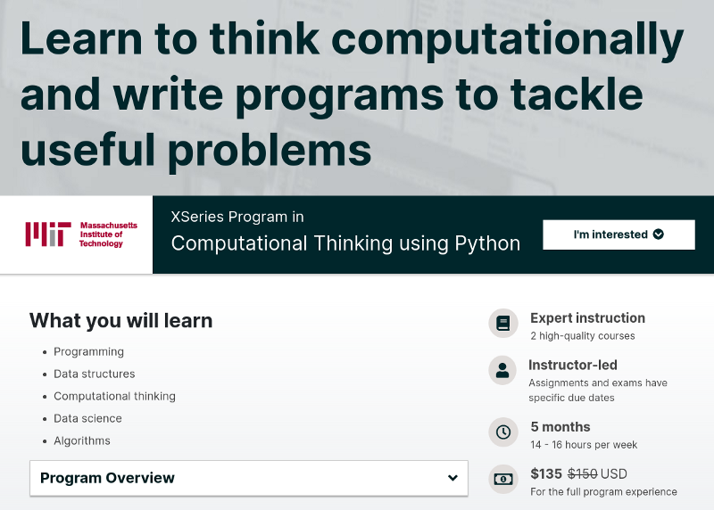
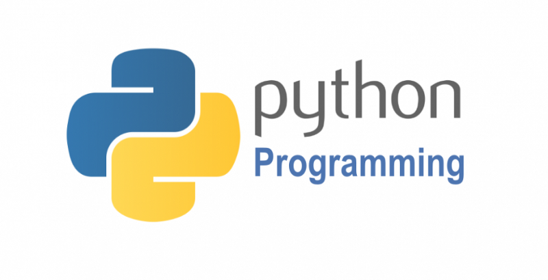
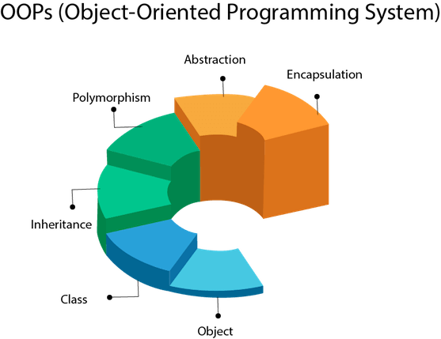

### …my Journey into Data Science So Far

My Data Science self-education journey has always been a bit upside down. Instead of the usual Math > Computer Science > Language/Framework > Machine Learning > Deep Learning path. I took the other way around. I stumbled into Deep Learning from the fast.ai ‘[Practical Deep Learning for Coders](https://course.fast.ai/)’ course first, which greatly boosted my interest and intention to learn more. Later I took the classic ‘Machine Learning’ course by [Andrew Ng](https://medium.com/u/592ce2a67248). (my review on these two courses [here](https://towardsdatascience.com/two-sides-of-the-same-coin-fast-ai-vs-deeplearning-ai-b67e9ec32133).) These are both great courses in their own merits and as I learn more and start doing my own projects, I found that my coding skills is stopping me from making solid progress. I had to stop and learn some programming concept on the fly to make sense of the important snippets in the course or GitHub. So I took the famous [CS50 course](https://towardsdatascience.com/this-is-cs50-a-pleasant-way-to-kick-off-your-data-science-education-d6075a6e761a) by Harvard celebrity [professor David J. Malan](https://en.wikipedia.org/wiki/David_J._Malan). It helped me a lot, but I still felt incompetent when it comes to Python programming, especially OOP, data structures, and algorithms, until I find **MIT 6.00.1x and 6.00.2x on Edx.**

### Overview

You can find the courses [here](https://www.edx.org/course/introduction-to-computer-science-and-programming-7) and [here](https://www.edx.org/course/introduction-to-computational-thinking-and-data-4). The course full names are:

> “Introduction to Computer Science and Programming Using Python”

> “”Introduction to Computational Thinking and Data Science”

They belong to the “[**Computational Thinking using Python**](https://www.edx.org/xseries/mitx-computational-thinking-using-python)” program on [EdX](http://edx.org). It used to be one course(YouTube playlist [here](https://www.youtube.com/watch?v=k6U-i4gXkLM&list=PL4C4720A6F225E074)) for MIT on-campus students. They split it into two parts, so it’s more digestible for online education. We can still treat them as one course since the lessons are closely related to each other.

Having taken both courses, here are my two cents if you don’t have the time to read through the rest of this article:

> **Start from ‘level 0’, well-designed learning curve, but still challenging**

> **Problem sets are challenging and fun, worth putting efforts in**

> **It covers most of the key concepts in Python, OOP, Data Structures, and algorithms (sorting, dynamic programming, etc.)**

> **The last part on Machine Learning somewhat lacks if you came from a Data Science/AI background.**

> **Some creative and fun way of teaching (Don’t miss the ‘archery in class’ one, really cracks me up)**

Overall, it’s an excellent course to invest your time in if you find yourself lacking basic programming training coming from the math side of data science. Let me elaborate a bit more if you are still interested.

### Comprehensive Python Coverage

The course starts assuming you don’t have any programming knowledge and uses Python as the language of choice. Python is easy to learn, versatile, and widely used in the Data Science/Machine Learning area. So if you’re not already familiar with Python, taking this course will take you into the door pretty quickly. It also covers data visualization in Python, which is quite useful for data science projects.

### Good Intro to OOP (Object-Oriented Programming)

Needless to say, OOP is at the foundation of most data science projects. You need to be good at it to do anything in data science and machine learning. It needs to be your second nature. This course has quite some lessons and problem sets centered around it. Just go with the flow, and you’ll grow familiar with the mindset. It’s not too in-depth but comprehensive enough to cover the essential OOP concepts (constructor, inheritance, polymorphism, etc.)

### Basic Data Structure and Algorithm

The data structure part is more relevant to data science since they are widely used. The algorithm part is less used yet still useful. What the course shines is the way they teach **recursion**. It’s just such an important concept that will help you immensely along your way and is somewhat very anti-intuitive to grasp. Lucky that this course makes it seem less daunting. I believe this is the part that benefited me the most.

### Machine Learning session is more or less lacking

Machine learning is a huge topic of its own to be taught in 3–4 lessons. This course adopts a ‘teach by example’ approach and showed a few cases of what it can do using a ready-made library like PyLab. Good to know if you’ve never learned Machine Learning before. But if you come from a data science background, I think it’s safe to pass this section to save you some time, unless you want to pursue a verified certification.

### Do the Problem Sets. Put efforts in. It will be well Worth it.

The problem sets are well thought out. There is a healthy gap between the lectures and what it takes to finish the problems. So you’ll have to do a bit of your own research and problem-solving. I found them to be challenging and fun. And this prepares you for real-world coding challenges where facing the unknown is inevitable. One thing to note is since the problem sets are cut into multiple pieces, it’s essential to go back and look at it as a whole once you finish every parts. This way, you have an idea of what you’ve accomplished and understand the problem-solving techniques involved deeper.

### Conclusion

Thank you for going this far for my review of these beautiful courses. I found myself more confident and smoother on coding my project or reading other people’s code, and I hope it can help you with your journey too. Good luck and happy learning!

* * *
Written on December 23, 2020 by Michael Li.

Originally published on [Medium](https://medium.com/@lymenlee/mit-6-00-1x-2x-review-a-data-scientists-point-of-view-205b8aec65f1)
