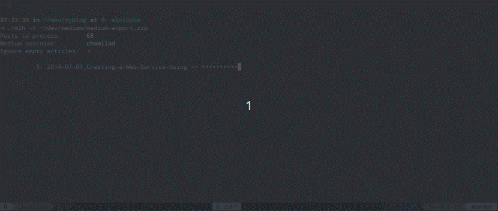

# Motivation
## Issues of Pelican


I've been using Pelican as the framework for my [data science blog](https://wayofnumbers.com) for a while now. It has worked for me, though there were always some minor glitches that made me feel not settled. It never feels complete and satisfying to me. Here are some of the big ones:
### Small community and niche position
Pelican has a much smaller community than Hugo. It has 10.4k stars vs. the 51.4k stars on GitHub. On the Static Site Generator community, Pelican is a niche. People already know Python might want to try it out (like me!), but others with better understanding and programming skills might prefer other options. 
With a smaller community comes with fewer themes, fewer plugins, and less support if you run into some weird issues. This is precisely my experience. 
### Lack of satisfying themes
It was pretty hard to find my current theme [Elegant](https://elegant.oncrashreboot.com/) that have both a good look and feel as well as utilities. There are not many options to begin with. 
### Small glitches that are hard to tackle
It took me quite some effort to fully get everything to work. Google Analytics, Disqus, Jupyter Notebook support, Table of Content, Read time, etc. During the process, I barely got any help since there simply weren't many people using it. So I have to dig deep into the source code to fix a minor issue. It's not that the process not worth the time(it was and very challenging and educational for me as a programmer), but why I have to dig out the rocks while I can tend the flowers?
### Speed, Speed, Speed
When it comes to speed as a programming language, Python sits on the 'slowest' end while Go is at the top(almost). What I can tell you is this: it shows on-site generating speed for sure. Pelican will take a couple of seconds to render all my articles (20+), while Go took a couple of milliseconds. Another big perk for Go is, it updates the site in real-time, while Pelican will lag behind a bit. This is more obvious when you made a small change and need to re-generate the whole site to see the updated version. Our time is too precious to be wasted, even a couple of seconds will add up to much. 

---

## Why Hugo

### Concurrency and speed
[Hugo](https://gohugo.io/) boast itself as "**The world’s fastest framework for building websites**", and I can definitely see why. [Golang](https://golang.org/) is developed by Google to solve their code efficiency problems and is known for its great concurrency prowess.  This transfers to Hugo pretty well. The standard build time for a Hugo site is on 100ms level while another static site generator is on 10 seconds level. If speed is your concern, then you'll definitely love Hugo. 
###  Good Community Support
Hugo's open source project on GitHub is currently showing 54.4k Stars. That is a pretty big number. Many people use Hugo as their framework of choice for personal/business blogs. This means it's easier to search for similar questions when in doubt. 
Also, the response time for Hugo's official  [forum](https://discourse.gohugo.io/) is relatively short,  given that you frame your question precisely. 
Hugo also has excellent [Documentation](https://gohugo.io/documentation/)  you can easily find what you want should you implement a new feature.
### Exposure to Go
Golang as a server-side language is gaining prevalence over the past couple of years among back-end developers. It's a language worth putting some time into. Working with Hugo will unavoidably expose you to Go, and you might learn a thing or two when building your site and get you started with Go.
### Themes, a lot of themes
Look no further at the official [Hugo theme site](https://themes.gohugo.io/). These are the free ones. There are also some sites that offer paid premium themes, and you can decide whether it's worth it. Free or paid, the Hugo theme community is very vibrant and active, result in many options to choose from. 
### Smooth Learning Curve
Some static site generator like [Gatsby](https://www.gatsbyjs.com/) You'll need to have a solid understanding of React to use it. For Hugo, you don't really have to learn Go first, though knowing some Go will make it even smoother to speed things up. 

---
# My First Hugo Site


Enough of the theorycrafting. Let's get down to the details. I'll organize this part in a chronological order to show the flow of how it's usually done and some issues I ran into, and how I tackled them. 
## Start from Quick Start
The simplest and best (to me at least) way to start your migration is to actually build a new site from scratch following the official [Quick Start](https://gohugo.io/getting-started/quick-start/). It's relatively easy to follow and doesn't even have many steps. It will help if you know a bit command line and Git but not required. Hugo comes with a powerful and intuitive CLI interface, and even if you don't know much about the command line, you can finish the tutorial not sweating. For example, build the site is only:
```hugo
hugo
```
The quick start will pick a theme for you([ananke](https://themes.gohugo.io/gohugo-theme-ananke/)) You can change it to your own choice later easily. The final site will look something like [this](https://themes.gohugo.io/theme/gohugo-theme-ananke/)
## Pick a Theme
Picking a theme is mostly subjective. Choose anything you want. Something that looks appealing to you and meets all your utility needs will be a good start. Just don't spend too much time nailing down your 'perfect one', with so many choices, you are likely to switch multiple times before settle on one that you really feel comfortable with. Mine is [Stack](https://themes.gohugo.io/hugo-theme-stack/) . For your first site, make sure to also have a look at the theme documentation cause you'll definitely need to read it multiple times to adjust it to your liking. 

---

# Configure and Adjust
Now comes the fun part, the **tinkering**! Tweak a theme to make it work for you for some people is daunting, but for me, it's daunting *and* exciting. It feels like puzzle solving. You get leads from theme documentation, Hugo documentation, YouTube videos, and stack overflow and put all the pieces together. When it's done, you'll feel excellent about yourself!
## Clone, Submodule, and Config
First thing first, git clone the theme to local drive:
```bash
git clone https://github.com/CaiJimmy/hugo-theme-stack/ themes/hugo-theme-stack
```
It helps to add the theme as a submodule. It's easier to manage with Git that way. And you'll need that for future deployment if you want to put your site on Netlify. 
Once the theme folder sits safely on your local drive, you just need to make some minor tweaks to the config file to make them work. You can do this in two ways. One is simply to change your current `config.toml` file:
```bash
echo theme \= \\"hugo-theme-stack\\" >> config.toml
```
But if you read the theme documentation, what's suggested is to simply copy the `config.yaml` file from the theme example site over, since there are other parts of the config you need to get right, and it's easier to start from the theme default config files. 
Once done, your simple site will start to look like this:

## Avatar
Now to the little details you need to iron out to make the theme work for you. The first thing that grabbed my attention is the glaring placeholder '150x150' avatar:


Gotta get rid of it first! Looking at the [documentation](https://docs.stack.jimmycai.com/configuration#avatar), the avatar needs to be put somewhere (I put it under `img` subfolder) under `assets` folder under the site root directory. Then change the `config.yaml` to tell Hugo where to find it:
```yaml
    sidebar:
        emoji: 🍥
        subtitle: Data Science for the Rest of Us 
        avatar:
            local: true 
            src: img/avatar.png
```

The site automatically reloaded, and the avatar got updated to my not-so-pretty photo:

## favicon
Favicon is that one little thing that when you have it, you never notice it. But if it's not there, the absence of it will nab you forever. Let's get that straight. 
I don't have a favicon for my site yet, so I somehow need to generate one. A quick way of doing this is to use [favicon.io](https://favicon.io/). It lets you generate your favicon out of an image, a couple of characters, or emoji of your like. For simplicity's sake, I decided to go with my first-name characters. You can always change them later if not satisfied. The UI looks something like the below:


With the favicon resource files downloaded, the next step is to figure out where to put them. Looking at the theme documentation, there's no mention of which folder it should be put under.  What is the best way to find information if official documentation is insufficient? GitHub, of course! Usually, people will complain about the lack of information on an open-source project's GitHub and submit issues. Let's see if we can find any clue there. After some search, the theme's GitHub page can be found [here](https://github.com/CaiJimmy/hugo-theme-stack) Search for 'favicon' within the repo, aha, we have 12 issues related to it:


The circled issue (though in Chinese) is the one we need, and it pointed us to the `/static` folder to put the favicon. I put it under `/static/img/`. Then update the `config.yaml` :
```yaml
params:
    mainSections:
        - post
    featuredImageField: image
    rssFullContent: true
    favicon: img/favicon-32x32.png
```
Reload, it works!

## Front Matter
[Front matter](https://gohugo.io/content-management/front-matter/) is the meta-data for your posts. It contains various predefined variables you can use, or you can customize your own if you prefer. It's all very flexible. In them, the `title`, `date`, `description`, `categories`, `tags`, and `image` are the most important. The `categories` and `tags` also decide how your content will be organized. 

## Content organizing and feature image
The theme allows for two ways to organize your content: categories and tags. To do so, just include them in your front matter, like so:
```markdown
---
image: 9-things-i-learned-from-blogging-on-medium-for-the-first-month.jpeg
title: "9 Things I Learned from Blogging on Medium for the First Month "
description: "Why Medium is a good platform to exchange ideas"
slug: 9-things-i-learned-from-blogging-on-medium-for-the-first-month
date: 2019-10-04T20:56:10.704Z
categories: Machine Learning
tags: 
- "Machine Learning"
- "Blogging"
- "Medium"
---
```
The theme will collect all your categories/tags defined in all your posts and put them together in the relative 'categories' and 'tags' page. You can also give a feature image for each category or tag. Just create `categories` and `tags` folder under `/content/`, and in each folder, create a subfolder for each category or tag, under which put in `_index.md` file and an image (say `ML.jpg`). Within the `_index.md` file, put a front matter variable `image` and point to the image `ML.jpg`. Like below:


Once configured, it should look like this:

## Shortcodes - Image Captions
Usually, images in **Markdown** files should be like this:
```markdown

```
But unfortunately, this doesn't work well with image captions. After a couple of trial and errors, I found that the Hugo shortcode `figure` works pretty well:
```markdown
{ {< figure caption="It ain’t much …" src="https://cdn-images-1.medium.com/max/2000/0*e5CJeyB0_LVFRe4a.jpg" >} }
```
It looks like this:


Now that the essential pieces are down, time to write a script to transfer my Pelican-based Markdown files to Hugo-based ones. 

---

# Writing the Pelican to Hugo migration script
Having figured out all the details of making the theme work, now it's time to transfer my posts tailored for Pelican to more Hugo-ready. This can be done easily with some Python scripting. I used code from this [GitHub repo](https://github.com/anthonynelzin/PelicanToHugo) as a base and adapted to my needs. The code is pretty self-explanatory. It reads every line of the old Markdown file, uses regex to search through phrases, and  needs updating and modifying each line accordingly, mostly front matter, image and video links. 

```python
#!/usr/bin/env python3
#
# Pelican to Hugo v20180603
#
# Convert Markdown files using the pseudo YAML frontmatter syntax
# from Pelican to files using the strict YAML frontmatter syntax
# that Hugo and other static engines expect.
#
# Anthony Nelzin-Santos
# https://anthony.nelzin.fr
# anthony@nelzin.fr
#
# European Union Public Licence v1.2
# https://joinup.ec.europa.eu/collection/eupl/eupl-text-11-12

import os, os.path, re
import subprocess
from shutil import rmtree, copytree

    #  Add the path to your files below
outpath = 'path/to/your/hugo/content/folder'
inpath = 'path/to/your/Pelican/content/folder'

def pre_process():

    # Clear files in outpath
    for files in os.listdir(outpath):
        path = os.path.join(outpath, files)
        try:
            rmtree(path)
        except OSError:
            os.remove(path)

    # copy all Markdown files over
    cp_cmd = f'cp {inpath}/*.md {outpath}/'
    os.system(cp_cmd) # need 'shell=True' if passing the whole command as a string

def pelicantohugo():
    files = os.listdir(outpath)

    for file in files:
        first_img = True
        file_name, file_extension = os.path.splitext(file)
        # Input files will be left in place,
        # output files will be suffixed with "_hugo".
        regexed_file = file_name + '_hugo' + file_extension
    
        # Only convert visible Markdown files.
        # This precaution is useless… until it is useful,
        # mainly on .DS_Store-ridden macOS folders.
        if not file_name.startswith('.') and file_extension in ('.md'):
            input_file = os.path.join(outpath, file)
            output_file = os.path.join(outpath, regexed_file)
    
            # The files will be edited line by line using regex.
            # The conversion of a thousand files only takes a few seconds.
            with open(input_file, 'rU') as fi, open(output_file, 'w') as fo:
                for line in fi:
                    # Frontmost handling
                    line = re.sub(r'(Title:)', r'title:', line)
                    line = re.sub(r'(Tags:)', r'tags:', line)
                    line = re.sub(r'(Date:)', r'date:', line)
                    line = re.sub(r'(Category:)', r'categories:', line)
                    line = re.sub(r'(Slug:)', r'slug:', line)
                    line = re.sub(r'(Summary:.*$)', r'', line)
                    line = re.sub(r'(author:.*$)', r'', line)
                    line = re.sub(r'(Subtitle:)', r'description:', line)
                    # Add closing frontmatter delimiter after the tags.
                    line = re.sub(r'(\[TOC\].*$)', r'---', line)
    
                    # Add opening frontmatter delimiter before the title.
                    line = re.sub(r'(title:)', r'---\n\1', line)
                    # Enclose the title in quotes.
                    line = re.sub(r'title: (.*)', r'title: "\1"', line)
                    line = re.sub(r'description: (.*)', r'description: "\1"', line)
                    # Change date formatting.
                    line = re.sub(r'(date: \d{4}-\d{2}-\d{2}) (\d{2}:\d{2})', r'\1T\2:00Z', line)
                    # Slow but insightful way to edit the tags.
                    if re.match(r'tags: (.*)', line):
                        # Split the comma separated list of tags.
                        tag_split = re.sub(r'(.*)', r'\1', line).split(', ')
                        # Output the new list of tags.
                        tag_plist = '\n- '.join(tag_split)
                        # Insert a newline before the list.
                        tag_list = re.sub(r'tags: (.*)', r'tags: \n- \1', tag_plist)
                        # And enclose the tags in quotes.
                        line = re.sub(r'- (.*)', r'- "\1"', tag_list)
                    # get proper slug
                    if re.match(r'slug: (.*)', line):
                        slug_match = re.search(r'slug: (.*)', line)
                        slug = slug_match.group(1)
                        os.system(f'mkdir {outpath}/{slug}')  # create subfolder using slug for feature image
                    if re.search(r'\(https://cdn.*?\)', line): 
                        img = re.search(r'!\[(.*?)\]\((https://cdn.*?)\)', line)
                        img_url = img.group(2)
                        img_caption = img.group(1)
                        if first_img:   # for first image which is the feature image, need special handling
                            first_img = False
                            if re.search(r'\.((?:jpg|png|jpeg|gif|svg))', img_url): 
                                img_e = re.search(r'\.((?:jpg|png|jpeg|gif|svg))', img_url)
                                img_ext = img_e.group(1)
                            else:
                                img_ext = 'jpeg'
                            # download image from Medium and put into the created subfolder
                            os.system(f'wget -O {outpath}/{slug}/{slug}.{img_ext} {img_url}')
                            line = ''
                        else:
                            # all other images just extract the image url and put into 'figure' shortcode
                            line = f'{ { { {< figure caption="{img_caption}" src="{img_url}" >} } } }'

                    # YouTube shortcode
                    if re.search(r'src="https://www.youtube.com/embed/(.*?)"', line):
                        video = re.search(r'src="https://www.youtube.com/embed/(.*?)"', line)
                        video_code = video.group(1)
                        line = f'{ { { {< youtube video_code >} } } }'
                    fo.write(line)
                # Print a little something about the conversion.
                #print(file_name + ' converted.')
            os.remove(input_file)

            # when all is ready, set the 'image:' front matter correctly so feature image could work
            with open(output_file, 'r') as fi:
                data = fi.readlines ()
            with open(output_file, 'w') as fo:
                image_meta_added = False
                for line in data:
                    # Add opening frontmatter delimiter before the title.
                    if not image_meta_added and not first_img:
                        line = re.sub(r'(---)', f'---\nimage: {slug}.{img_ext}', line)
                        image_meta_added = True
                    fo.write(line)
        if not first_img: os.system(f'mv {output_file} {outpath}/{slug}/index.md')

pre_process()
pelicantohugo()

```


####Some points worth noticing:####
1. The script will remove everything in the output folder(Hugo content folder) and regenerate them all from the source folder. 
2. **Front matter**: Heavily use regex to replace meta-data. e.g. from 'Title' to 'title', 'Subtitle' to 'description', date format, etc. 
3. **Image**: Extract Medium CDM URL, download the image, and put it under post subfolder so that the feature image could work. Other images were put into a `{{figure}}` Hugo shortcode for better captioning.
4. **YouTube**: extract the video ID and put it into `{{youtube}}` Hugo shortcode. It works like a charm.

## Transfer my new Medium posts into Hugo markdown
I have some Medium posts that have not yet been transferred to my Pelican blog, so another script is needed. No need to write it myself. I used a Python script from the [GitHub repo](https://github.com/chamilad/medium-to-hugo). You need to use Medium's export service to get all your posts into a zip file and then use the script to turn them into Hugo markdown. Since there weren't many posts, I did some adapting manually to create the subfolders for each article so the feature image could work. 


# Switch repo on Netlify
Finally, we have everything we need, now is the time to toggle the switch on Netlify from Pelican to Hugo. Exciting!
First of all, I created a repo for the Hugo site, [here](https://github.com/wayofnumbers/wayofnumbers_hugo) 
Then, log into my Netlify account,  go to my site, then hit `SIte Settings`:


Choose `Build & Deploy` tab, then hit `Edit Settings`, like so:


Choose `Link to a different repository->`,  a wizard screen will show up, where you can pick your Hugo repository. Do that, and do some basic build settings. Among them, notice the build command is simply `hugo`.  One thing worth noticing is the Hugo version. The default Hugo version on Netlify is not high enough to properly build my site, and I ran into many weird errors. I found the solution to add a `netlify.toml` on my site root directory and assign the Hugo version inside of it. You can find the reference guide [here](https://docs.netlify.com/configure-builds/common-configurations/hugo/). 
Once all settings are done, a new build generates the new site. 

---

# Overall Feeling
Wow, this is a long post. I appreciate whoever made this far. I hope this long article helps a bit on your journey into the HUGO land. Finally, I want to share my overall feelings of the whole process:
1. It's not hard but requires some ironing out quite some wrinkles. (Also the fun part?)
2. Theme adopting takes the longest time. The documentation helps but often not complete. Github issues help tremendously. 
3. There are a lot of very kind people who wrote scripts to automate the migration. Use them, but don't hesitate to modify them to your needs. A little programming goes a long way, especially when you have many articles.


---


> **Bonus**
> [YouTube series](https://youtube.com/playlist?list=PLLAZ4kZ9dFpOnyRlyS-liKL5ReHDcj4G3) I use to learn Hugo basics, all in bite-size.
