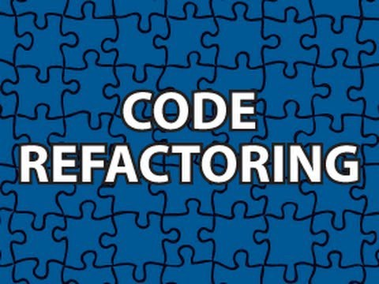

### What is UAT?

What exactly is Universal Approximation Theorem? Well, put in layman’s terms, UAT just means that giving a one hidden layer neural network with enough neurons. It can approximate(or simulate closely) any continuous function within the given input range. It means that a one hidden layer neural network is an ultimate flexible function approximator. Maybe a little too flexible.

### A Lesson Learned

**Because of the flexibility, Universal Approximation Theorem used to push AI researchers to focus mostly on shallow neural networks, thus in some way hinders the development progress of deep learning.**This is interesting. Come to think of it, a ‘shallow and wide’ neural net tends to ‘remember’ all features to approximate the target function. Yet deeper networks tend to be more abstract on feature extraction and finds out patterns that can apply to many parts of the dataset. They obviously generalize better. And achieve better results with less computational power.

### Going Deeper

What does this sounds to you if you’re a software developer? **‘Code Refactoring’!**Developers refactor their code to put repetitive code snippets into functions and reuse them as much as possible. Cleaner codes usually are better codes. Deep Neural Networks somewhat does the same thing. By having more layers, it enables the network to ‘refactor’ themselves better and learn more general patterns, thus more efficient in achieving the same goal. This leads to better (both in performance and efficiency) models.

### Software 1.0 vs. Software 2.0

What other software development techniques we can apply to machine learning? More precisely, what we learned from ‘Software 1.0’ can be applied to ‘Software 2.0’? (If you are not familiar with the concept of ‘Software 2.0, I highly recommend you watch the below video from [Andrej Karpathy](https://medium.com/u/ac9d9a35533e), not entirely applicable to everything but definitely worth noting and backed by Tesla’s success!)

According to Karpathy, what we currently do in software engineering where talented people write code to complete tasks and solve a problem is ‘Software 1.0’, where humans contribute to the process by directly telling the computer how to do every single step. In the new paradigm of ‘Software 2.0’ where machine learning and deep learning is widely adopted, human contribute by providing a huge amount of examples of people doing something in the form of the dataset, and the computer along with models will figure out how to do that automatically. In fact, a good amount of Tesla’s Autopilot system is powered by deep learning models.

Some people are still skeptical about whether there will be a bright future for the ‘Software 2.0’ approach. Our path from 1.0 to 2.0 is still up for debate. Re-apply the wisdom from traditional software engineering might still be a good direction to explore for machine learning researchers and practitioners. Fun time!

If you want to know more about Universal Approximation Theorem, you can refer to my article below:

[From Legoland to Neural Networks: Universal Approximation Theorem in Layman’s Terms | by Michael Li | Dec, 2020 | Towards Data Science](https://towardsdatascience.com/from-legoland-to-neural-networks-universal-approximation-theorem-in-laymans-terms-6d1e41f5a8bb?source=your_stories_page-------------------------------------)

* * *
Written on January 3, 2021 by Michael Li.

Originally published on [Medium](https://medium.com/@lymenlee/universal-approximation-theorem-code-refactoring-for-software-2-0-20d4bdc3cf48)
